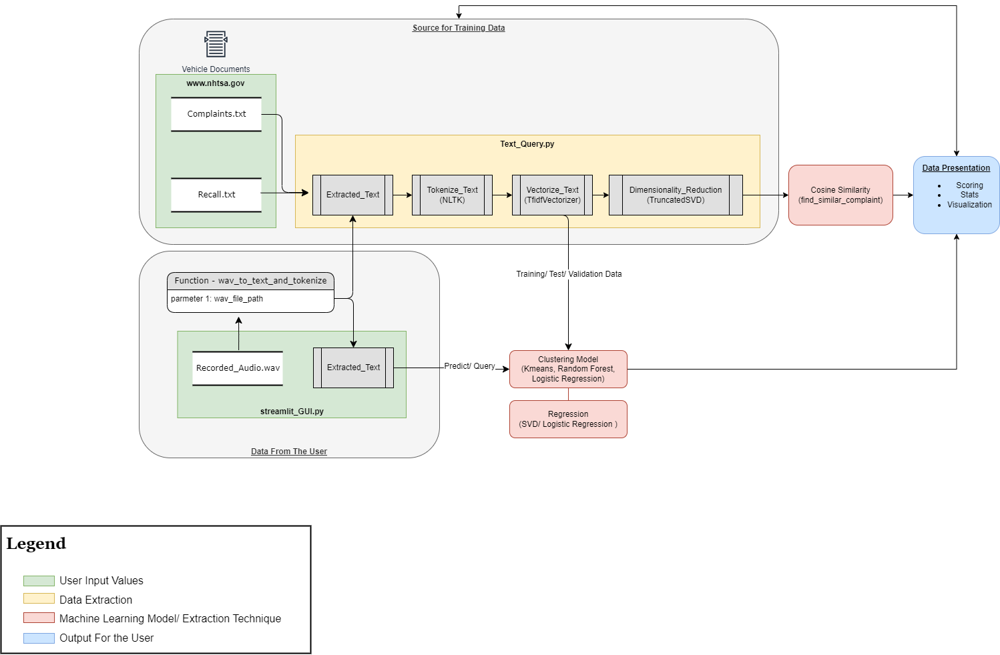

# SIADs_Audio_Text_SRS
## System Flow Diagram
This is a high level flow diagam showing the data flow for the project.



## Top-Level Directory Layout

    .
    ├── .streamlit                   # Settings for Streamlit (dependency for Streamlit)
    ├── Datasets                     # Ingested Files (gitignore)
    ├── env                          # Python Virtual Enviroment (gitignore)
    ├── Experiments                  # Python classes for rapid experimentation
    ├── Exploration                  # Data exploration to gain new ideas on machine learning methods
    ├── helpers                      # Utility functions such as wrapper functions for data pickling
    ├── Resources                    # Images for the README.md (dependency for README.md)    
    ├── src                          # Source files (`app` and imports for the streamlit_GUI.py)
    ├── Test                         # Folder for impromptu tests
    ├── .gitignore
    ├── LICENSE
    ├── README.md
    ├── requirements.txt
    └── streamlit.GUI.py


## Project Enviroment Setup and Running Code
### Step 1: Create a Virtual Enviroment
created in a Python 3.10.11 instance virtual enviroment
```
PS C:\Repo\SIADs_capstone_vehicle_complaints_and_recalls> python3 -m pip install virtualenv
PS C:\Repo\SIADs_capstone_vehicle_complaints_and_recalls> python3 -m venv env
```
Once the venv is created active the venv
```
PS C:\Repo\SIADs_capstone_vehicle_complaints_and_recalls> .\env\Scripts\activate
```
When running the virtual enviroment you should see (env). The next step is to pip install the requirements file
```
(env) PS C:\Repo\SIADs_capstone_vehicle_complaints_and_recalls> pip install -r requirements.txt
```
Deactivate the virtual environment by issuing the “deactivate” 
```
(env) PS C:\Repo\SIADs_capstone_vehicle_complaints_and_recalls> deactivate  
PS C:\Repo\SIADs_capstone_vehicle_complaints_and_recalls> 
```
When adding pip installs into the virtual enviroment the below command will update the requirements for other users.
```
python -m pip freeze > requirements.txt
```
### Step 2: Download Data
A sample dataset can be be downloaded from google dive, pending using a umich email address. There is an excel file that has recall and complaint data combined. There are also pickeld files which allow for running streamlit without having to extract, vectorize, and train models.

https://drive.google.com/drive/folders/1fmBg9eUN8n9z1pPNDqQU-YcLBESC86NF?usp=drive_link

The NHTSA website is where the original datasets came from and can be downloaded from, there are also APIs if direct ties to the data source are desired. There are option for different time spans for grabbing data.
 
https://www.nhtsa.gov/nhtsa-datasets-and-apis#

### Step 3: Running the Streamlit
Run the below command in a power shell terminal to launch the streamlit application.
```
(env) PS C:\Repo\SIADs_capstone_vehicle_complaints_and_recalls> python -m streamlit run 'C:\Repo\SIADs_capstone_vehicle_complaints_and_recalls\streamlit_GUI.py'
```
To stop the python streamlit app
